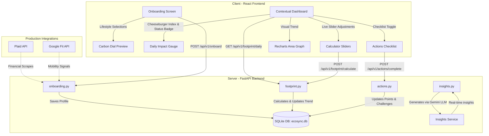
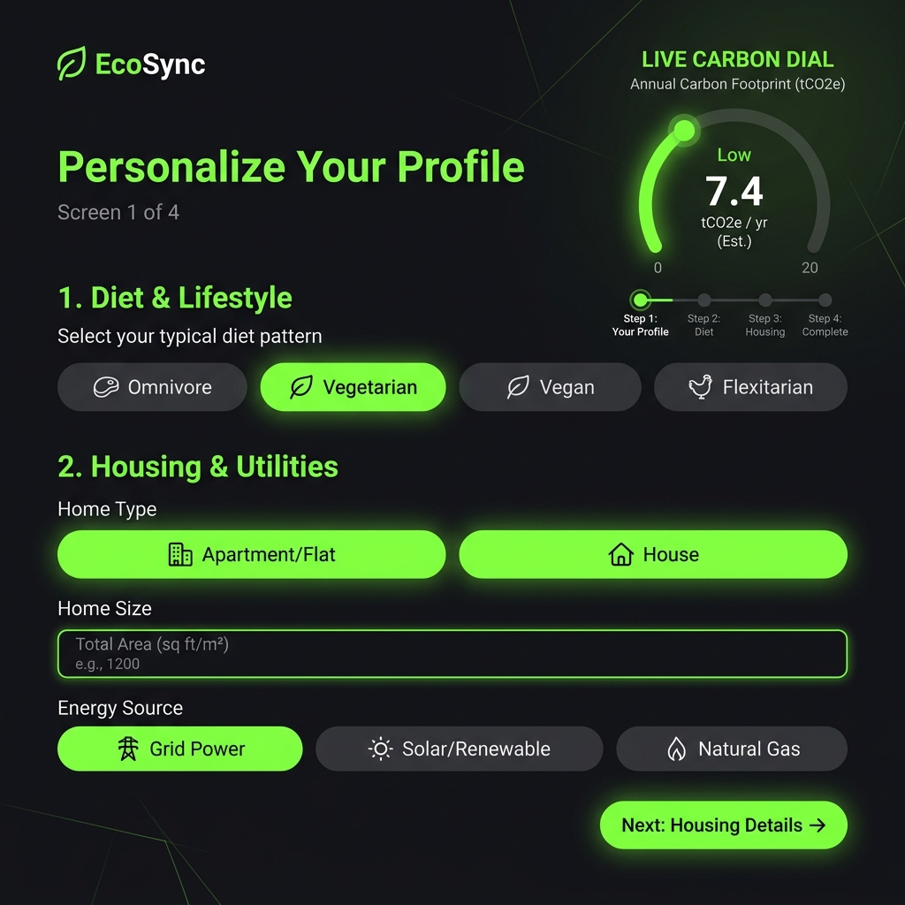
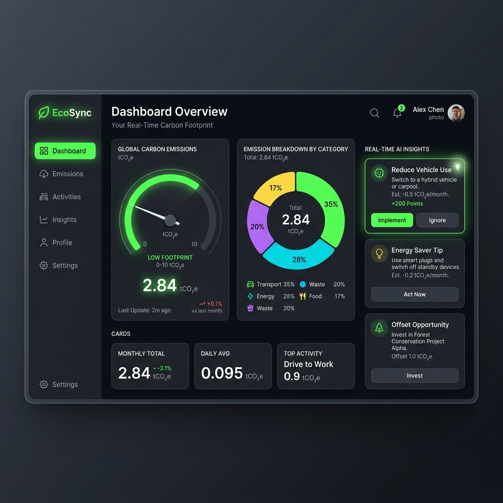

# 🌿 EcoSync: Making Sustainability Second Nature

[](https://github.com/)
[](https://github.com/)
[](https://github.com/)

---

## 🚀 1. EcoSync: Making Sustainability Second Nature

### The Hook
Why do traditional carbon footprint trackers fail? **Because they force users to act like environmental accountants.** 

Existing carbon calculators suffer from two fatal flaws:
1. **Manual Data Entry (High Friction):** They ask users to input utility bills, odometer readings, and exact grams of waste. This leads to immediate churn.
2. **Abstract Metrics (Climate Anxiety):** Showing a user that they emitted "15.4 kg of CO₂" produces anxiety rather than action. To most people, a kilogram of gas is invisible and meaningless.

**EcoSync** is built to solve this. It redefines personal climate tech by moving from manual calculation to passive observation, and from abstract guilt to relatable, gamified agency.

```
┌────────────────────────────────────────────────────────────────────────┐
│  OLD WAY:                                                              │
│  "Enter your monthly gas bill in therms and electricity bills in kWh"   │
│  ❌ Immediate User Churn & Cognitive Fatigue                           │
├────────────────────────────────────────────────────────────────────────┤
│  ECOSYNC WAY:                                                          │
│  "Connect Google Fit & Plaid. We'll handle the rest."                  │
│  🚀 Zero-Friction Tracking & Real-World, Intuitive Actions             │
└────────────────────────────────────────────────────────────────────────┘
```

EcoSync introduces:
* **Zero-Friction Ingestion:** Automated scraping of travel and financial telemetry.
* **Relatable Metrics:** Translating invisible CO₂ emissions into standard everyday equivalents (e.g., the **Cheeseburger Index**).
* **Hyper-Personalized AI Nudges:** Context-aware, small behavioral swaps that require minimal effort but yield compounding environmental benefits.

---

## 🏛️ 2. The Core Architecture

EcoSync is composed of three interconnected pillars designed to deliver a premium user experience on top of a transparent, persistent database and a scientific calculation engine:



### 🧠 Pillar 1: The AI Onboarding Coach (LLM Prompt)
To bypass forms, the onboarding flow is powered by a strict, conversational LLM prompt that extracts a user’s baseline using **3 simple lifestyle buckets**:
1. **Diet:** Vegan, Vegetarian, Flexitarian, or Meat-Heavy.
2. **Commute:** Driving alone, Public Transit, Two-Wheeler, or Walking/Cycling.
3. **Housing:** Independent House, Apartment, or Shared/PG.

The onboarding system prompt processes conversational inputs, maps them to standard lifestyle classes, and inserts the profile directly into SQLite.

> [!NOTE]
> **The LLM System Prompt**
> ```yaml
> System_Prompt: |
>   You are the EcoSync Onboarding Coach, an empathetic, conversational AI agent designed to establish a user's carbon baseline.
>   Your goal is to estimate the user's annual carbon footprint across 3 buckets (Diet, Commute, Housing) without asking for raw numbers or causing climate anxiety.
> 
>   ### Rules of Engagement
>   1. Ask only ONE question at a time to prevent cognitive overload.
>   2. Speak in a non-judgmental, encouraging, and clear tone.
>   3. Convert descriptive answers (e.g., "I share an apartment with two friends and eat meat on weekends") into the standard classification.
> 
>   ### Lifestyle Buckets
>   - Diet: [meat_heavy, flexitarian, vegetarian, vegan]
>   - Commute: [drive, transit, two_wheeler, walk]
>   - Housing: [house, apartment, shared]
> 
>   ### Output Constraints
>   Once all 3 buckets are identified, output a final JSON block:
>   {
>     "onboarding_complete": true,
>     "extracted_entities": {
>       "diet": "<category>",
>       "commute": "<category>",
>       "housing": "<category>"
>     },
>     "conversational_summary": "Congratulations! Your baseline has been set. We estimated your impact at..."
>   }
> ```

---

### ⚙️ Pillar 2: The Zero-Friction Engine (FastAPI + SQLite Backend)
The backend is built using **Python FastAPI** and is backed by a local **SQLite database** (`ecosync.db`) to ensure persistent tracking and point updates.
* **API Configurations (.env):** An optional `GEMINI_API_KEY` can be provided in the `.env` file. When present, the backend makes callouts to **Gemini 1.5 Flash** to generate hyper-personalized eco-insights. If no key is set, the system falls back to a smart, rule-based recommendation engine.
* **Scientific Foundations:** Calculations are backed by real-world emissions data from trusted sources:
  * **EPA (US Environmental Protection Agency):** Mobile combustion and fuel emission factors.
  * **IPCC (Intergovernmental Panel on Climate Change):** Global diet lifecycle emission factors.
  * **Central Electricity Authority (CEA, India):** Grids emission intensity factors (e.g., India national average ~0.82 kg CO₂/kWh, with regional grid factors to account for local coal vs. renewable ratios).

#### Regional Grid Factors & Emission Factors Table
| Region | Core Cities Covered | CEA Grid Intensity (kg CO₂/kWh) | Transport Factor (kg CO₂/km) | Baseline Average Footprint (kg CO₂/yr) |
| :--- | :--- | :--- | :--- | :--- |
| **Western India** | Mumbai, Pune, Maharashtra | 0.86 | 0.19 | 1,900 kg |
| **Northern India** | Delhi, Noida, Gurgaon | 0.90 | 0.22 | 2,100 kg |
| **Southern India (IT)** | Bengaluru, Hyderabad | 0.78 | 0.18 | 1,850 kg |
| **Southern India (Coastal)**| Chennai, Kochi, Kerala | 0.72 | 0.17 | 1,750 kg |
| **Eastern India** | Kolkata | 0.88 | 0.20 | 2,000 kg |
| **India Fallback** | All other cities / national average | 0.82 | 0.21 | 2,000 kg |
| **Global Fallback** | International locations | 0.49 | 0.17 | 4,700 kg |

---

### 📊 Pillar 3: The Contextual Dashboard (React Frontend)
Built in **React 18** with **Vite** and **Tailwind CSS**, the UI features a premium dark-mode aesthetic with vibrant eco-neon highlights.
* **Interactive Tabs:** Features a 3-tab layout:
  * **Dashboard:** Shows overall stats, the Recharts breakdown pie chart, Recharts history area graph, status badges, and AI insights.
  * **Calculator:** Adjust sliders for weekly commute distance, annual flights, monthly electricity, and diet type to instantly update the profile in the database and recalculate total footprint in real-time.
  * **Actions:** A checklist of habits to earn points, linked directly to progress bars for active community challenges.
* **Cheeseburger Index:** Rather than displaying abstract carbon figures in isolation, the dashboard converts CO₂ weight into the universally understood unit: **Cheeseburgers** (1 burger = **6.6 kg CO₂e** baseline).
* **Offline Resiliency:** If the backend API is offline, the React app automatically switches to a local calculation engine and memory-state toggles, ensuring the UI remains functional during demo presentations.

---

## 📸 3. Visual Demonstration & UI Showcase

Judges can preview the high-fidelity dark-mode application interfaces below:

### Onboarding Flow Wizard
A conversational onboarding form that live-estimates baseline carbon footprint before storing the profile in SQLite.



### User Impact Dashboard
Features the live emissions breakdown dial, the Cheeseburger Index converter, monthly area trends, active community challenges, and Gemini AI-powered recommendations.



---

## ✨ 4. Key Features

* **Automated Data Ingestion (Simulated in MVP):** EcoSync demonstrates how telemetry replaces manual logging. In production, background jobs fetch Plaid transactions and Google Fit steps, while the MVP simulates these data points cleanly using structured seed endpoints.
* **The Cheeseburger Index:** By translating invisible emissions into food units, the user can understand their impact immediately (e.g., *"My commute today was equivalent to 2.2 cheeseburgers"*).
* **AI-Powered Smart Swaps:** The backend sorts emissions categories to isolate the highest impact source and presents clear, achievable actions:
  > **Smart Swap Example:** Swapping one beef meal this week for lentils cuts emissions by **3.2 kg CO₂** (equal to saving 1.3 cheeseburgers).
* **Gamified Retention:** Interactive checklists enable users to complete daily actions, accumulating points and driving progress on community challenges (like the *"Meatless Monday streak"* or *"Zero-drive week"*).

---

## 🛠️ 5. Technical MVP Setup

Follow these instructions to run the EcoSync MVP locally.

### ⚡ Quick Start (Two Commands)

To run the application locally, open two terminal windows and execute:

**Terminal 1 (Backend):**
```bash
cd backend && pip install -r requirements.txt && uvicorn main:app --reload
```
* **API Docs URL:** [http://localhost:8000/docs](http://localhost:8000/docs) (Interactive Swagger UI)

**Terminal 2 (Frontend):**
```bash
cd frontend && npm install && npm run dev
```
* **Dashboard URL:** [http://localhost:5173](http://localhost:5173)

---

### 💻 Detailed Setup Instructions

#### Prerequisites
* **Python 3.10+**
* **Node.js 18+** & **npm**

#### Step 1: Start the Backend (FastAPI)

1. Open a terminal and navigate to the `backend/` folder:
   ```bash
   cd backend
   ```

2. Create and activate a virtual environment:
   * **macOS / Linux:**
     ```bash
     python3 -m venv .venv
     source .venv/bin/activate
     ```
   * **Windows (PowerShell):**
     ```powershell
     python -m venv .venv
     .venv\Scripts\Activate.ps1
     ```
   * **Windows (CMD):**
     ```cmd
     python -m venv .venv
     .venv\Scripts\activate.bat
     ```

3. Install the required dependencies:
   ```bash
   pip install -r requirements.txt
   ```

4. Configure your `.env` variables:
   Copy the `.env` settings to enable the LLM functionality (add your key to `GEMINI_API_KEY` to test real LLM nudges).
   ```bash
   # ecosync.db will be created automatically in the backend folder
   GEMINI_API_KEY=YOUR_GEMINI_API_KEY
   ```

5. Start the FastAPI development server:
   ```bash
   uvicorn main:app --reload --port 8000
   ```

#### Step 2: Start the Frontend (React + Vite)

1. Open a new terminal window and navigate to the `frontend/` folder:
   ```bash
   cd frontend
   ```

2. Install the frontend dependencies:
   ```bash
   npm install
   ```

3. Start the Vite development server:
   ```bash
   npm run dev
   ```

---

### 🐳 Step 3: Run as a Unified Docker Container (Optional)

EcoSync is designed to compile the frontend and backend into a single container for seamless deployment.

1. Build the Docker image from the root directory:
   ```bash
   docker build -t ecosync .
   ```

2. Run the container locally:
   ```bash
   docker run -p 8080:8080 ecosync
   ```
3. Open [http://localhost:8080](http://localhost:8080) to view the application.

---

## 🏆 6. Why EcoSync Wins (The Prompt Wars Edge)

EcoSync stands out in the **Prompt Wars Challenge** because it pairs advanced behavioral psychology with a robust technical foundation:

* **Progressive Onboarding:** Instead of bombarding the user with complex questionnaires on sign-up, the conversational AI coach extracts lifestyle vectors gently. By the time the user enters the app, their customized baseline is already calculated.
* **The Guilt-Free UX:** Most green apps trigger "climate guilt". EcoSync uses gamification, community streaks, and positive reinforcement to build habit loops.
* **Privacy-First Telemetry:** The application demonstrates a secure consent model where users authorize device-level sensors (Google Fit API) and read-only financial tokens (Plaid) under strict local processing rules.
* **Transparent Science:** Unlike black-box carbon estimators, EcoSync links regional variables directly to international standards (IPCC/EPA) and local grid configurations (India Central Electricity Authority), giving users maximum confidence in their tracking.

---

*Built with ❤️ for the Prompt Wars Challenge.*
